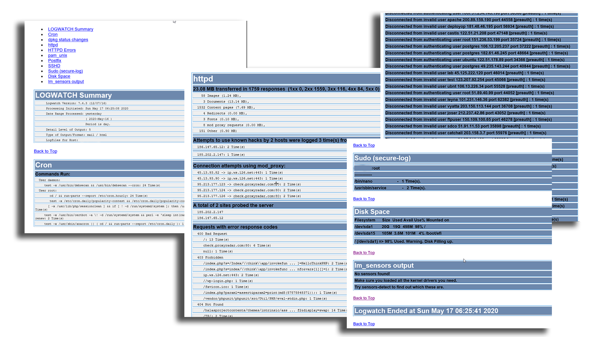

# Logs


 **Syslog** c'est le protocole qui gére les journaux d'événements d'un système informatique


## Permission ⚫ 

les fichiers log se situe en général dans le dossier **`/var/log`** on doit vérifier les paramètre de permission de ce dernier et essayer de le séparer dans une partition seul 

## Rotation ⚫ 

On doit activer le System de rotation qui vas empêcher la saturation des fichiers logs

```text
more /etc/logrotate.conf
```

## Distance ⚫ 

externalisé les fichiers de traces afin d’écrire les log dans un fichiers distant grâce a TCP/UDP

```text
more /etc/rsyslog.conf
```

## Superviser les fichiers logs 🔴 

On devrai contrôler tout les alerts provenant de nos fichiers logs et rester a jour afin d’éviter tout type d'attaque, donc pour cela on est dans l'obligation de configurer ou d'installer un superviseur de fichiers log afin de recevoir des mail par exemple **logwatch,nagiox**





