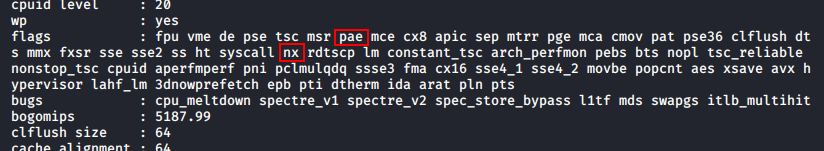

# Materials

## CPU Flag 🔴 

```text
dmseg | grep cpu
```

```text
more /proc/cpuinfo
```

Check that the CPU has the PAE and NX flags




Pae and nx Protects instruction execution stored in the unauthorized memory region




## Mémoire

```text
dmesg | grep memory
```

```text
more /proc/meminfo
```

```text
vmstate -s | grep memory
```

## Swap

Once the memory is full the System will automatically switch to swap memory so we must check its presence and have a minimum of SWAP memory on our system

```text
vmstat -s | grep swap
```

## Disque

```text
dmesg | grep disk
```

```text
lsblk
```

We must check the partitioning aspect of the disk and identify the partitioning faults and the wrong mounting option \(**This part is before installing the OS**\)

```text
sudo fdisk -l
```

To have more details on a partitioning

```text
blkid /dev/sda2 
```


There is another type named LVM2 stronger than ext4

So another remark would have to verify the partitioning and the insulation which protects the components of the System example the  **`/tmp/`** folder would have to isolate it😉 

Check the list of partitions that are mounted automatically at startup

```text
cat /etc/fstab
```

