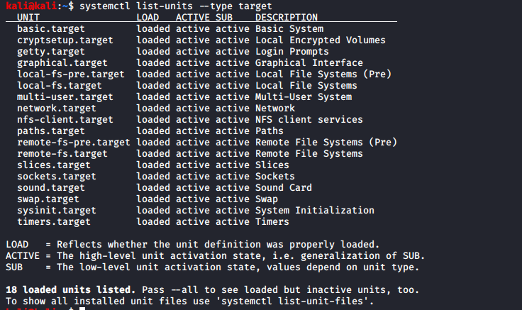

# Processus Démarrage

## GRUB 

System d'execution avant l'os

```text
move /etc/default/grub /boot/grub/grud.d
```

## Iommu ⚫ 

On ajoute iommu au démarrage, pour protéger la mémoire dans accès non contrôler. 

```text
vi /etc/default/grub
```

`GRUB_CMDLINE_LINUX = " ...` **`iommu=force`**`"`

## Grub Password Protection 🔴 

Crée un nouveau utilisateur avec un mot de passe chiffré afin de protéger l’accès au Shell de Grub:

```bash
cat /etc/grub.d/01_users

#!/bin/bash

cat <<EOF
set superusers="putyourusernamehere"
password putyourusernamehere grub.pbkdf2 grub.pbkdf2.sha512.10000.3450C89...
EOF
```

## Droit 🔴 

passer les droit 700 **\(Lecture & Ecriture que par 'root'\)** sur l'arborescence grud.d

```text
chmod -R 700 /etc/grud.d/
```

## Module ⚫ 

Bloquer les chargement de modules supplémentaires

```text
echo "kernel.modules_disabled=1" >> /etc/sysctl.conf
```

## Console virtuelle

`alt` + `ctrl` + \( `F1`,`F2`,`F3`,`F4`, ... `F7`\)

`alt` + `ctrl` + `f1` = graphique mode

`alt` + `ctrl` + `f2` = Shell

### Bloquer l'accès 🔴 

Bloquer l'acces 'root' a la console virtuelle \( vider le contenue du fichier**`securetty`**\)

```text
echo > /etc/securetty
```

### Intervalle de connexion ⚫ 

Augmenter le temps minimal \( 5 s~ 10s\) pour chaque tentative de connexion \( Eviter bruteforce attack\) 

```text
nano /etc/pam.d/system-auth 
```

## Désactiver `Ctrl+Alt+Supr` 🔴 

Désactiver la combinaison afin que l’utilisateur ne redémarre pas la machine 

```text
cd /etc/systemd/system; ln -sf /dev/null /etc/system.d/system/ctrl-alt-del.target
```

## Touche Magic ⚫ 

Désactiver les Magic System Requst Keys

```text
sysctl kernel.sysrq
```

```text
echo "kernel.sysrq=0" >> /etc/sysctl.conf
```

Afin de désactiver les touche sur les session déjà ouvert 

```text
sysctl -w kernel.sysrq=0
```

## \*Service de démarrage \(inutile\)

**Systemd** \(**SysV** sur ancienne machine\) est un **daemon** \( Processus qui s'execute en arriere plan \) qui gère de plusieurs processus et service du System d'exploitation pour les visualiser:

```text
systemctl list-units --type target
```



### Cible par défaut

```text
systemctl get-default
who -r
```


Visualiser tout les service 

```text
sudo service --status-all
ls /etc/init.d
```

pour stoper un service 🔴 

```text
systemctl stop <service>
service <name> stop
```

Ne plus démarrer le service sur notre **`default-target`**

```text
systemctl disable <service>
```

### Dépendances de la cible par défaut

Pour visualiser tout les target :

```text
ls -lrtha /etc/systemd/system
```

Pour vérifier les dépendances de notre target-level \(les level qui se lance âpre le notre\)

```text
more /lib/systemd/system/<notre-target>
```

Verifier tout les target pour voir leur service lancer:

```text
systemctl list-unit-files --type service
```

