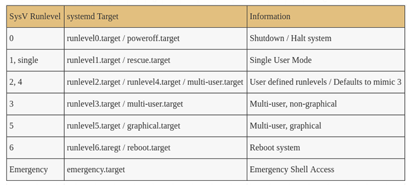

# Start-up process

## GRUB 

Execution system before the os

```text
move /etc/default/grub /boot/grub/grud.d
```

## Iommu ⚫ 

We add iommu at startup, to protect non-controlling access memory.

```text
vi /etc/default/grub
```

`GRUB_CMDLINE_LINUX = " ...` **`iommu=force`**`"`

## Grub Password Protection 🔴 

Create a new user with an encrypted password to protect access to the Grub Shell

```bash
cat /etc/grub.d/01_users

#!/bin/bash

cat <<EOF
set superusers="putyourusernamehere"
password putyourusernamehere grub.pbkdf2 grub.pbkdf2.sha512.10000.3450C89...
EOF
```

## Droit 🔴 

pass the right 700 \(Read & Write only by 'root'\) on grud.d tree

```text
chmod -R 700 /etc/grud.d/
```

## Module ⚫ 

Block loading of additional modules

```text
echo "kernel.modules_disabled=1" >> /etc/sysctl.conf
```

## Virtual console

`alt` + `ctrl` + \( `F1`,`F2`,`F3`,`F4`, ... `F7`\)

`alt` + `ctrl` + `f1` = graphique mode

`alt` + `ctrl` + `f2` = Shell

### Block access 🔴 

Block 'root' access to the virtual console \(empty the content of the securetty file\)

```text
echo > /etc/securetty
```

### Connection interval ⚫ 

Increase the minimum time \(5 s ~ 10s\) for each connection attempt \(Avoid bruteforce attack\)

```text
nano /etc/pam.d/system-auth 
```

## Disable `Ctrl+Alt+Supr` 🔴 

Disable the combination **`Ctrl`**+**`Alt`**+**`Supr`** so that the user does not restart the machine

```text
cd /etc/systemd/system; ln -sf /dev/null /etc/system.d/system/ctrl-alt-del.target
```

## Magic Key⚫ 

Disable Magic System Requst Keys

```text
sysctl kernel.sysrq
```

```text
echo "kernel.sysrq=0" >> /etc/sysctl.conf
```

In order to deactivate the keys on the session already opened

```text
sysctl -w kernel.sysrq=0
```

## Service de démarrage \(inutile\)

Systemd \(SysV on old machine\) is a daemon \(Process that runs in the background\) which manages several processes and operating system service to view them:

```text
systemctl list-units --type target
```


### Default Target

```text
systemctl get-default
who -r
```




View all services

```text
sudo service --status-all
ls /etc/init.d
```

To stop a service 🔴 

```text
systemctl stop <service>
service <name> stop
```

Stop starting the service on our **`default-target`**

```text
systemctl disable <service>
```

### Default target dependencies

To view all targets:

```text
ls -lrtha /etc/systemd/system
```

To check the dependencies of our target-level \(the level which starts with ours\)

```text
more /lib/systemd/system/<notre-target>
```

Check all the targets to see their launched service :

```text
systemctl list-unit-files --type service
```

