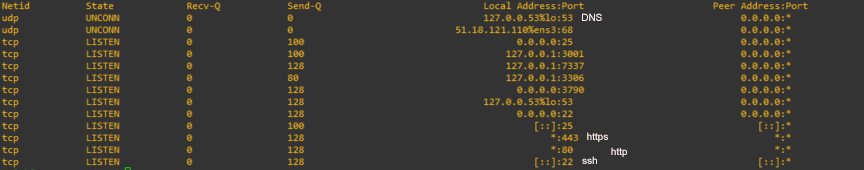

# Réseau

## Socket & Ports 🔴 

The network is the main vector of attack on a server, each open service implies the opening of port\(s\) so we must check the list of open ports in our system

```text
ss -lptun
```



| Flag | Description |
| :--- | :--- |
| l | Show all listening sockets |
| p | Display the process using the socket |
| t | Show TCP sockets |
| u | View UDP protocol sockets |
| n | Display open ports in digital mode |

In order to close a port you have to stop its example service

```text
systemctl stop postfix
systemctl disable postfix ( pourdebon )
```


## TCP Wrappers 🔴 

the TCP Wrappers process \(libwrap library\) contains two files **`/etc/hosts.allow`** and **`/etc/hosts.denny`**, The first allows connection authorization and the last refuses if a rule is cited in the two files the property is assigned to **`hosts.allow`**

To check if a service can be compatible with the libwrap library

```text
which sshd
ldd /usr/sbin/sshd | grep libwrap
```

finally we can for example add in the files**`hosts.allow`**

**`sshd: 192.176.2.3/255.255.255.0`**

we can refuse any connection for example by adding to the files **`hosts.deny`**

**`sshd:all`**



## Firewall \(IPTABLE\) 🔴 

To verify that the kernel is properly compiled to use the firewall

```text
version=$(uname -r); grep IPTABLES /boot/config-${version}

CONFIG_IP_NF_IPTABLES=m
CONFIG_IP6_NF_IPTABLES=m
```

The \(**m**\) means module so it would be better to recompile the kernel in order to make netfilter integrated and not a module

In order to see the current rules:

```text
sudo iptables -L -n
```

would be better to configure **netfilter** to not leave the machine open for everyone if we want to secure our server

If we want to add a new policy we must add it to the config file, since on the command line will be valid until the next restart \(warm\)

```text
service iptables save
```

## \* /etc/sysctl.conf

## SSH 🔴 

### Version

Check that the recent version of the Protocol

```text
ssh -v localhost
```

### Root

Disable access to root account

```text
more /etc/ssh/sshd.config | grep PermitRootLogin
```

### Port 22

Change port 22 so that it is not known to the public

```text
grep port /etc/ssh/sshd.config
```

### Empty Password

Prevent login without password

```text
grep PermitEmptyPassword /etc/ssh/sshd.config
```

### Idle

Prevent idle connection

```text
grep ClientAliveInterval /etc/ssh/sshd.config
```

### Authorization

Allow just login to certain user or group

```text
AllowUsers user1,user2
AllowGroups groupe1,groupe2
```

### Trace Failed Auth

Trace failed connection attempts, for example rough 2 attempt trace will be detailed

```text
MaxAuthTries 2
```

In order to display the last failed connection

```text
sudo lastb
```

### Key

Enable fair key authentication \(public / private\)

```text
PasswordAuthentification No
PubKeyAuthentification Yes
```

