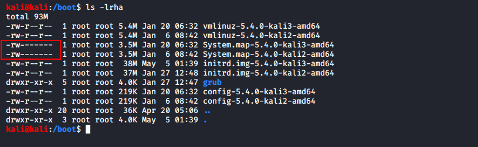

# System

## Limiter l'acces a `/boot/`🔴 

le dossier **`/boot/`** contiens notre noyau donc faudrait bien le protéger 

le fichier **`/boot/system.map`** contient les table des symboles utilisé par le noyau associé aux adresse mémoire Ce fichier est souvent la cible d'attaques visant à exploiter les failles dans le code du noyau.

```text
ls -lrth / | grep boot
```

```text
dr-xr-xr-x. 5 root root 4,0K 27 mars 09:34 boot
```



## Mise a jour 🔴 

Vérifier la signature et l’efficacité des package installer 

```text
more /etc/apt/sources.list
```

Lister tout les packages installer dans le system

```text
dpkg -l
yum list installed
```

Nettoyage systeme des package inutil

```text
sudo apt-get autoremove --purge
```

Mettre a jour le system

```text
sudo apt-get update
sudo apt-get upgrade
```

