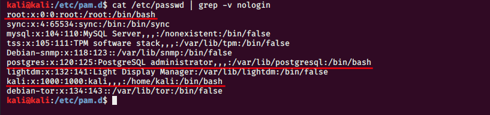
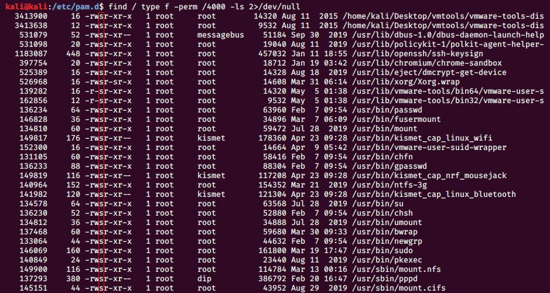

# Users

## User & Password

l'authentification sur linux s’appuie sur le module pam il est responsable de chiffré le mot de passe et le stocké 

```text
ldd /bin/passwd  | grep pam
```

les mot de passe s'ont chifré est stocké sur le fichiers shadow

```text
more /etc/shadow
```

donc on doit vérifier que le module pam stock les mot de passe sur le fichier shadow est non pas sur passwd 🔴 

```text
grep shadow /etc/pam.d/*
```

## Strong Password ⚫ 

Faudrait gérer les configuration pour une fort qualité de mot de passe:

```text
more /etc/security/pwquality.conf
```

## Shell 

On vérifie les compte qui vont possédé un Shell a leur connexion

```text
cat /etc/passwd |grep -v nologin
```



## Changement de Password 🔴 

On doit ajouter une règle afin d'informer nos utilisateurs de changer leur mot de passe tout les 'x' jours

```text
change -m 7 -M 90 -w 10
-m : duré de vie
-M: x jour
-w: message warning vant 10 jour
```

## Valeur par Default ⚫ 

Vérifier les valeurs par défaut des attribut de mots de passe pour chaque utilisateurs :

```text
nano /etc/login.defs
```

## Setuid 🔴 

le setuid permet a les utilisateur d’exécuter et d'accedez a un fichiers avec le 'sudo' pour verifier tout les fichiers qui contient le setuid

```text
find / -type f -perm /4000 -ls 2>/dev/null
```



il as aussi les permission setuid pour un groupe 

```text
find / -type f -perm /6000 -ls 2>/dev/null
```

## Stickbit 🔴 

Tout les users peuvent ajouter et modifier mais seul root a le droit de supprimer example le dossier **`/tmp/`**

```text
find / -type d -perm -1000 -exec ls -ld {} \;
```


## Sudo 🔴 

on crée un nouveau groupe 'admin' et on ajoute dessus les users concerné comme sa on évite l'appel de Command 'sudo'  par d'autre utilisateur 

```text
groupadd admin
chmod 4750 /usr/sbin/sudo
chwon root:admin /usr/bin/sudo
```

```text
ls -lrtha /usr/bin/sudo
```

## Sudoers 🔴 

Afin de changer les action que le groupe admin aura en exécutant la command 'sudo'

```text
nano /etc/sudoers
```

**`%admin ALL-(ALL) ALL`**

